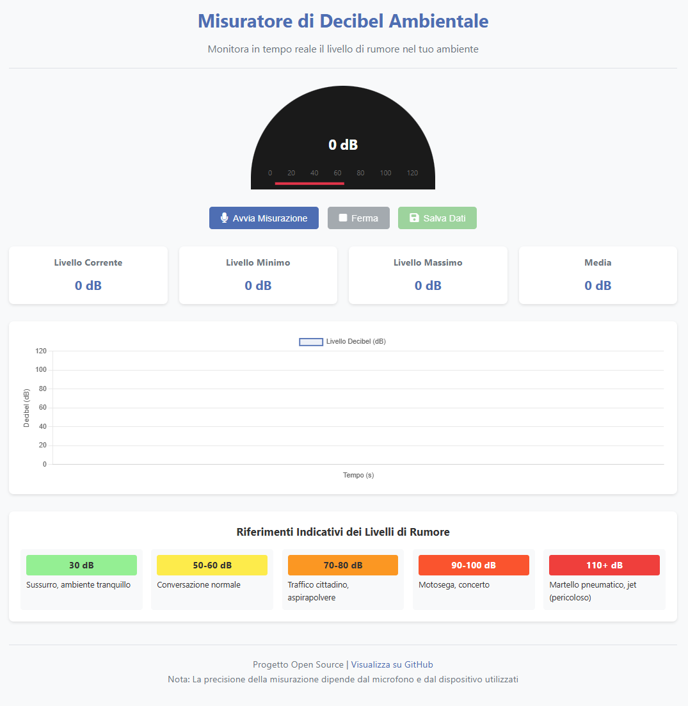

# decibel.js
Misuratore di decibel ambientali tramite browser

# Misuratore di Decibel Ambientale

Un'applicazione web per misurare il livello di rumore ambientale in decibel utilizzando il microfono del dispositivo. Il progetto è completamente basato su tecnologie web (HTML, CSS e JavaScript) e può essere facilmente ospitato su GitHub Pages.



## Caratteristiche

- Misurazione in tempo reale dei livelli di rumore ambientale
- Visualizzazione grafica tramite un misuratore ad ago
- Tracciamento delle variazioni nel tempo con un grafico
- Statistiche con livelli minimi, massimi e medi
- Riferimenti indicativi dei livelli di rumore
- Esportazione dei dati in formato CSV
- Design responsive per dispositivi mobili e desktop
- Interfaccia utente intuitiva e accattivante

## Demo

Una demo dell'applicazione è disponibile all'indirizzo: [https://nomeutente.github.io/decibel-meter/](https://nomeutente.github.io/decibel-meter/)

## Come iniziare

### Prerequisiti

- Un browser web moderno che supporti l'API Web Audio (Chrome, Firefox, Edge, Safari)
- Un dispositivo con microfono (laptop, smartphone, tablet)

### Installazione e utilizzo locale

1. Clona il repository sul tuo computer:
   ```
   git clone https://github.com/nomeutente/decibel-meter.git
   ```

2. Naviga nella directory del progetto:
   ```
   cd decibel-meter
   ```

3. Apri il file `index.html` nel tuo browser preferito o utilizza un server web locale

### Configurazione per GitHub Pages

1. Dopo aver clonato il repository, accedi al tuo account GitHub
2. Crea un nuovo repository chiamato `decibel-meter`
3. Carica tutti i file nel nuovo repository:
   ```
   git remote set-url origin https://github.com/nomeutente/decibel-meter.git
   git push -u origin main
   ```
4. Vai su Settings > Pages
5. Nella sezione "Source", seleziona il branch "main" e la cartella "/ (root)"
6. Clicca su "Save"
7. Attendi qualche minuto e il tuo sito sarà disponibile all'indirizzo `https://nomeutente.github.io/decibel-meter/`

## Struttura del Progetto

```
decibel-meter/
├── index.html          # Pagina principale
├── css/
│   └── style.css       # Stili CSS
├── js/
│   └── app.js          # Logica dell'applicazione
├── img/
│   └── screenshot.png  # Screenshot per il README
└── README.md           # Documentazione
```

## Limitazioni e avvertenze

- La precisione delle misurazioni dipende dalla qualità del microfono e dalla calibrazione del dispositivo
- I valori in decibel sono approssimativi e non dovrebbero essere utilizzati per misurazioni professionali
- È necessario concedere i permessi di accesso al microfono
- Alcuni browser potrebbero richiedere che il sito sia servito tramite HTTPS per accedere al microfono
- Le prestazioni possono variare a seconda del dispositivo e del browser

## Tecnologie utilizzate

- HTML5
- CSS3
- JavaScript (ES6+)
- Web Audio API
- Chart.js (per i grafici)
- Font Awesome (per le icone)

## Contribuire

I contributi sono sempre benvenuti! Se desideri contribuire:

1. Fai un fork del repository
2. Crea un branch per la tua funzionalità (`git checkout -b feature/nuova-funzione`)
3. Effettua le modifiche necessarie
4. Commit dei tuoi cambiamenti (`git commit -m 'Aggiungi nuova funzione'`)
5. Push al branch (`git push origin feature/nuova-funzione`)
6. Apri una Pull Request

## Problemi noti e roadmap

### Problemi noti
- La calibrazione può variare significativamente tra diversi dispositivi
- Il consumo della batteria può essere elevato durante l'uso prolungato

### Funzionalità future
- Modalità di calibrazione per migliorare la precisione
- Supporto per notifiche quando i livelli superano una soglia
- Modalità dark/light per l'interfaccia
- Possibilità di impostare sessioni di registrazione programmate
- Analisi spettrale delle frequenze

## Licenza

Questo progetto è rilasciato con licenza MIT. Vedi il file `LICENSE` per ulteriori dettagli.

## Contatti

Per domande, suggerimenti o problemi, apri un issue sul [repository GitHub](https://github.com/nomeutente/decibel-meter/issues).

---

*Nota: Sostituisci "nomeutente" con il tuo nome utente GitHub in tutti i link e comandi.*

